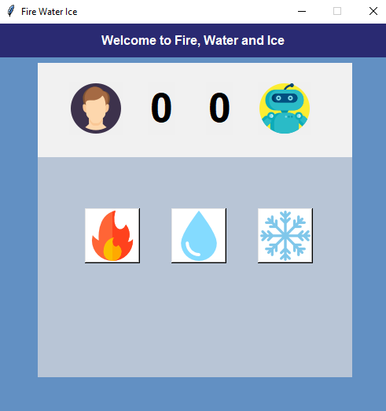

# Fire,Water and Ice
**Version 1.0.0**

A simple game made in Python with TKinter.
Inspired from the classical "Rock,Paper and Scissors"

I made this little project just for fun.
<br>
Enjoy it and don't look at bugs &#128027;  &#128513;.


<br>
<br>

<br>
<br>


# Usage and dependencies
To run this game you just need to run the following command
``` 
python game_gui.py

```
If you have problems, try to change your current directory with
``` 
cd /YourCurrentPath/.../fire_water_ice

```


## License and Copyright
Distributed with no license.You are free to modify and redistribute it.

